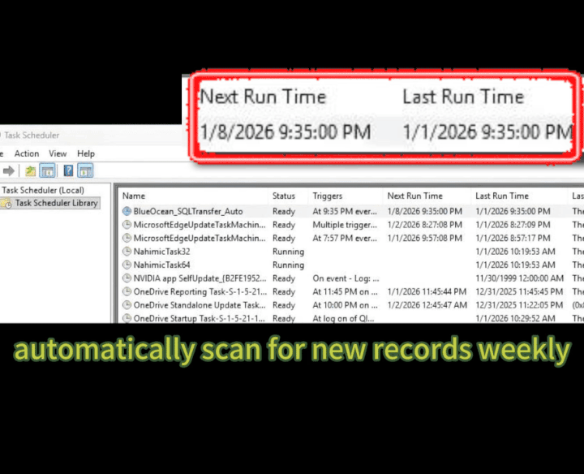

# Warehouse SQL Pipeline (Python → MySQL) for Operational Analytics

## 30-Second Overview

This project rebuilds an Excel-heavy warehouse reporting workflow into a reliable and
repeatable SQL data pipeline using Python and MySQL.

The pipeline ingests monthly **Excel files** covering outbound shipments and
customization / assembly operations, standardizes schemas, performs row-level
deduplication, and loads clean records into MySQL as a single source of truth.

The resulting database layer supports Power BI dashboards, operational analytics,
and downstream Python modeling, while remaining safe to re-run and fully traceable
to the original source files.

---

## 1. Business Context

Warehouse operations generate high-volume event-level data, including:

- Outbound shipment records (daily shipping activity)
- Customization / upgrade / downgrade / assembly workflows
- Customer and SKU identifiers (with varying completeness by source)
- Inventory snapshots (optional, for constrained demand analysis)

In the original workflow, analysts maintained dozens of Excel files and relied on
manual merges and checks. As data volume grew, this approach became:

- time-consuming and error-prone  
- difficult to audit or trace back to sources  
- hard to scale for automated reporting and analytics  

This project centralizes operational records in MySQL, enabling consistent,
queryable, and automation-friendly analysis.

---

## 2. Analytical Objective

- Build a **single source of truth** in MySQL for outbound and customization records
- Enable repeatable analysis for:
  - daily / weekly shipment volume and trends
  - client and SKU activity analysis
  - operational KPIs (throughput, mix, exceptions)
  - Power BI dashboards and Python analytics
- Ensure the pipeline is:
  - **idempotent** (safe to run multiple times)
  - **deduplicated** (no double inserts)
  - **traceable** (each record linked to its source file)

---

## 3. Data Sources

Typical inputs are monthly exported **Excel files**, including:

- Outbound shipment records (e.g., 2024-01 through 2025-06)
- Customization / assembly records  
  (e.g., `value_added`, `custom_record`, with subtypes such as prebuilt / outbound)
- Optional: inbound records, inventory snapshots, SKU master data

> Note: File names typically follow consistent naming patterns, allowing
> batch ingestion by directory.

---

## 4. Pipeline Architecture

### High-Level Flow

1. **Extract**
   - Batch read Excel files from `/data/raw/...`
2. **Transform**
   - Standardize column names and data types
   - Normalize date and timestamp fields
   - Clean and map identifiers (UPC, SN, stock_out_code, client_code)
   - Add lineage metadata (`source_file`, `source_row`, `category`)
3. **Load**
   - Insert records into MySQL using a hash-based primary key
   - Apply `INSERT IGNORE` / `ON DUPLICATE KEY` logic for safe re-runs

---

### Why Hash-Based Primary Keys?

Operational Excel exports often lack a stable unique identifier.
This project generates a deterministic primary key:

